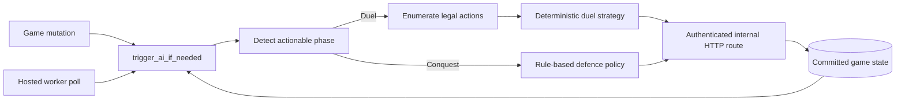

# AI Opponent

Status: current architecture reference

Nepal Kings uses deterministic, server-side automation for Duels and Conquest
defences. The active decision path does not call an external language model.
Historical module and variable names may still refer to planners or the former
LLM experiment, but `ai.duel_strategy` and the rule-based Conquest loop make
the shipped decisions.

## Goals

The AI is designed to be:

- rules-compliant: it uses the same server mutation routes as human actions;
- deterministic: a stored game seed and loop iteration reproduce choices;
- bounded: action loops, retries, waits, and telemetry buffers have caps;
- durable: hosted workers rediscover actionable games from PostgreSQL;
- observable: decisions, retries, phases, and worker sweeps are logged;
- safe under concurrency: one environment worker holds advisory leadership,
  and only one active thread can own a game inside that process.

The Duel service account is `[AI] Strategos`. Conquest automation can also act
for a player-owned land's saved defence while that player is offline.

## Runtime flow



Mutating routes can trigger automation immediately. The hosted always-on
worker also polls durable candidate games, so a missed in-process trigger or a
provider restart does not permanently strand an AI turn.

## Core modules

| Module | Responsibility |
|---|---|
| `server/background_worker.py` | Hosted poll loop, sweeper schedule, and environment leadership |
| `server/ai/ai_worker.py` | Triggering, per-game loops, route execution, retries, and Conquest policy |
| `server/ai/action_enum.py` | Phase detection and legal Duel action enumeration |
| `server/ai/duel_strategy.py` | Deterministic phase-specific action choice |
| `server/ai/strategy_planner.py` | Bounded candidate plans and scores for normal Duel turns |
| `server/ai/card_change_strategy.py` | Main/side card protection and exchange selection |
| `server/ai/figure_completion.py` | Figure completion estimates used by planning |
| `server/ai/game_state.py` | AI-oriented state enrichment and power context |
| `server/ai/defence/` | Deterministic land-defence templates by tier and suit |

## Hosted worker

`manage.py run-worker` invokes `background_worker.run_forever()`.

The worker:

1. refuses to run when AI is disabled;
2. acquires one lifetime leadership lock;
3. initializes required AI users;
4. polls unfinished Conquest games and Duels containing an AI user;
5. triggers actionable games when `AI_JOBS_ENABLED=True`;
6. periodically runs the stuck-Conquest sweeper;
7. releases leadership and database connections on shutdown.

PostgreSQL uses a session advisory lock namespaced by environment. Local
SQLite development uses a file lock. A second worker exits rather than running
concurrently as another leader.

Verify hosted ownership with:

```bash
python scripts/verify_postgres_worker.py \
  --env-file /path/to/private.env \
  --environment staging
```

## Duel decision pipeline

For an AI Duel turn:

1. serialize and enrich the committed game state;
2. detect the current phase;
3. enumerate legal actions through `action_enum`;
4. take the only action immediately when exactly one exists;
5. otherwise seed `random.Random` from `game.ai_seed` and the loop iteration;
6. choose through `duel_strategy.choose_action()`;
7. execute through the normal authenticated server route;
8. reload committed state and repeat while the AI still owns an actionable phase.

The deterministic phase handlers cover:

- `normal_turn`: score bounded plans, penalize repeated card-changing, and
  sample near-greedily from the strongest small candidate set;
- `select_defender`: prefer legal lower-power targets;
- `battle_decision`: fight or fold from estimated total advantage;
- `battle_round`: gamble weak moves, combine eligible Daggers, respect Block,
  and preserve stronger resources when a round is already neutralized;
- `battle_shop`: confirm when ready, otherwise combine or buy useful moves;
- `counter_spell`: counter only when the response is legal and the estimated
  harm clears the configured policy threshold.

Softmax sampling is seeded and intentionally low-temperature. It produces
limited variety without making replays irreproducible.

## Conquest automation

Conquest uses a separate rule-based loop because the defender acts from a
persisted land configuration rather than a normal Duel hand.

The policy can:

- cast a configured legal counter spell;
- counter-advance with the configured defence figure;
- resolve Civil War second-figure selection or skip when none is legal;
- select a legal defender while respecting required fields, forced targets,
  checkmate constraints, and Invader Swap rules;
- fight instead of folding;
- confirm prepared tactics;
- gamble weak tactics, combine eligible Daggers, and select a battle play;
- finish battles and perform post-battle card selection;
- resolve no-legal-figure states without leaving the game deadlocked.

The land-defence generator builds deterministic, feasibility-checked templates
for all supported land tiers. A generator version bump invalidates older
cached AI templates when generation rules change.

## Authentication and route execution

AI mutations go through internal HTTP requests to the same route contracts used
by players. The AI service account uses a server-generated token. Automated
Conquest defence for a human-owned land receives a bounded internal service
token for the owning account and adds the private internal-request marker.

This preserves route authorization, validation, transaction, logging, and
serialization behavior instead of maintaining a second mutation implementation.

Internal credentials never belong in client responses or documentation.

## Concurrency and recovery

- `_active_games` prevents two local AI threads from owning one game.
- `_pending_retrigger` records state changes that arrive while a loop is active.
- Each loop has a bounded iteration count.
- Failed actions try safe alternatives without repeating the same dead action.
- The watchdog retries unsuccessful exits with a retry cap and wall-clock cap.
- The durable hosted poller rediscovers unfinished actionable games.
- The stuck-game sweeper resolves supported abandoned Conquest transitions.

Correctness still belongs in server route and domain-service transactions. AI
locks prevent duplicate automation; they are not a substitute for atomic game
mutations.

## Configuration

| Variable | Default | Purpose |
|---|---:|---|
| `AI_ENABLED` | `True` | Enables AI accounts and automation |
| `AI_JOBS_ENABLED` | `True` | Incident switch for hosted AI turn execution |
| `AI_THINK_DELAY` | `2` | Human-readable delay before Duel actions |
| `AI_STRATEGY_PLANNER_ENABLED` | `True` | Enables bounded normal-turn planning |
| `AI_STRATEGY_PLANNER_MAX_PLANS` | `5` | Candidate-plan cap |
| `AI_STRATEGY_PLANNER_MAX_MAIN_DRAWS_PER_TURN` | `2` | Main-draw planning assumption |
| `AI_STRATEGY_PLANNER_MAX_SIDE_DRAWS_PER_TURN` | `1` | Side-draw planning assumption |
| `AI_STRATEGY_PLANNER_RUNTIME_WARNING_MS` | `120` | Slow-planner warning threshold |
| `AI_WATCHDOG_RETRY_DELAY` | `4` | Delay between watchdog retries |
| `AI_WATCHDOG_MAX_RETRIES` | `3` | Watchdog retry cap |
| `BACKGROUND_WORKER_POLL_SECONDS` | `2` | Hosted durable-state polling interval |

Production configuration lives in the private environment file. Restart the
always-on task after changing worker-only settings.

## Observability

Useful signals include:

- worker start/stop, environment, poll interval, and sweep summaries;
- game id, phase, loop iteration, chosen action type, and safe fallback;
- watchdog scheduling and exhaustion;
- bounded planner events returned by the debug snapshot;
- `/healthz` and `/readyz` application release/schema identity;
- provider task state plus PostgreSQL advisory-lock verification.

Do not log hands, tokens, database URLs, private messages, or hidden opponent
information merely to make AI debugging easier.

## Testing

Primary coverage includes:

- `tests/server/test_duel_strategy.py` — deterministic phase policies and seed replay;
- `tests/server/test_ai_worker.py` — triggering, route execution, Conquest
  fallbacks, retries, and telemetry;
- `tests/server/test_ai_defence_generator.py` — tier/suit feasibility and determinism;
- `tests/server/test_ai_strategy_planner.py` — plan generation and scoring;
- `tests/server/test_ai_figure_completion.py` — recipe completion estimates;
- full Duel and Conquest lifecycle tests for the transitions the AI calls.

Run focused AI coverage with:

```bash
.venv/bin/python -m pytest -q \
  tests/server/test_duel_strategy.py \
  tests/server/test_ai_worker.py \
  tests/server/test_ai_defence_generator.py
```

## Extending the AI

1. Add legality to server rules first.
2. Expose the legal action in `action_enum` or the Conquest policy.
3. Add deterministic scoring or selection using the supplied seeded RNG.
4. Execute through the normal route contract.
5. Add tests for legality, hidden-information boundaries, deterministic replay,
   failure fallback, and deadlock prevention.
6. Update this guide and any player-facing behavior documentation.

Do not reintroduce an external model dependency into the production action path
without an explicit architecture, privacy, cost, latency, fallback, and replay
review.
