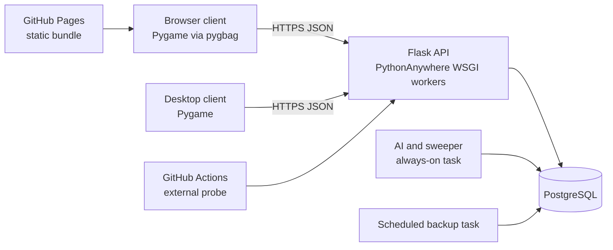

# Architecture

Nepal Kings is a server-authoritative tactical game with one Python client
codebase for desktop and browser delivery. The client renders and collects
intent; the Flask API validates and persists game state.

## Runtime topology

Local development replaces PostgreSQL with SQLite and can run background work
inside the server process. Staging and production use separate databases,
roles, secrets, WSGI apps, and background tasks.

## Component responsibilities

### Client

`nepal_kings/` owns rendering, input, navigation, local preferences, sound,
animations, and HTTP orchestration. It may predict or present state, but it
does not decide authoritative game outcomes.

Important boundaries:

- `main.py` selects resolution and server routing before launching the game.
- `game/screens/` coordinates user flows and visible state.
- `game/components/` contains reusable controls and presentation objects.
- `utils/` owns HTTP compatibility, tokens, background polling, and account
  service calls.
- The browser build packages the same source with pygbag and a custom web shell.

### API and domain services

`server/` owns authentication, authorization, legality, transactions,
serialization, persistence, AI coordination, and operational endpoints.

- `routes/` handles HTTP parsing, authorization, and response contracts.
- `game_service/` contains reusable state transitions and rules.
- `models.py` defines SQLAlchemy persistence.
- `migration_runner.py` owns ordered schema evolution.
- `startup.py` creates a fresh schema, applies migrations, and performs bounded
  maintenance when explicitly invoked.
- `observability.py` adds structured logging and request IDs.
- `/healthz` reports process/release liveness; `/readyz` also verifies database
  and schema readiness.

### Background worker

Hosted AI turns and stuck-game sweeps run outside WSGI workers. The always-on
task reads durable state from PostgreSQL and holds an environment-specific
advisory lock, so a duplicate task cannot become a second leader. Web workers
therefore remain request-focused and safe to scale independently.

### Persistence

- **Local development:** SQLite for convenience and fast resets.
- **Staging:** isolated PostgreSQL database for integration, migration, load,
  and release-candidate verification.
- **Production:** isolated PostgreSQL database with validated provider-side and
  encrypted off-provider backups.

The database is the authority for accounts, collections, games, configurations,
land ownership, kingdom state, moderation, analytics, and worker coordination.

## Key request flows

### Authentication

1. Client registers or logs in over HTTPS.
2. Server validates account status and credentials.
3. Server issues a signed token containing the user's token version.
4. Protected routes verify the token and current account state.
5. Password changes, moderation, and deletion increment the token version to
   revoke older sessions.

### Duel or Conquest mutation

1. Client sends intent and the relevant resource identifier.
2. Route verifies identity, visibility, phase, and feature switches.
3. A domain service performs the mutation inside the database transaction.
4. The server serializes viewer-appropriate state.
5. The client animates the committed result and polls for later remote turns.

Hidden hands and unrevealed tactics are viewer-aware. Public field figures and
finished results remain visible according to the game rules.

### Deployment

1. A commit passes tests, PostgreSQL compatibility, dependency audit, and
   security scan.
2. The immutable release is backed up and promoted to staging.
3. Staging is migrated, reloaded, probed, and smoke-tested.
4. The same application release is promoted to production under maintenance.
5. After readiness, worker, CORS, account, and gameplay checks pass,
   maintenance is disabled.
6. Relevant `main` changes build and publish the GitHub Pages client.

See [deployment.md](deployment.md) for the workflow and the
[PythonAnywhere runbook](../deploy/pythonanywhere/README.md) for exact commands.

## Security and privacy boundaries

- The browser origin is explicitly allowlisted; CORS paths are never included
  in origin values.
- Hosted secrets live in mode-restricted files outside immutable releases.
- Database URLs and passwords are never passed in backup command arguments.
- Production refuses an ephemeral signing key, implicit database URL,
  destructive startup reset, or SQLite unless the legacy fallback is explicit.
- Request IDs connect client errors to structured server logs without exposing
  credentials.
- Legal documents are public; account and moderation data require the
  appropriate authenticated viewer or operator path.

## Repository architecture

| Path | Responsibility |
|---|---|
| `nepal_kings/` | Client runtime and distributable assets |
| `server/` | API, rules, persistence, workers, and startup policy |
| `tests/` | Client/server regressions and operational contracts |
| `scripts/` | Non-runtime maintenance, build, probe, load, and backup tools |
| `deploy/` | Hosting templates and provider runbooks |
| `docs/` | Durable guides, operations, legal text, plans, and evidence |
| `.github/workflows/` | CI, security, web deployment, installers, and probes |

## Design principles

- Keep the server authoritative and mutations atomic.
- Separate hosted background work from request workers.
- Treat staging and production as isolated environments, not modes of one database.
- Prefer measured performance work over architectural speculation.
- Keep current guides distinct from historical plans and deployment evidence.
- Preserve the free-plan branch as a rollback option without constraining the
  paid production architecture.
